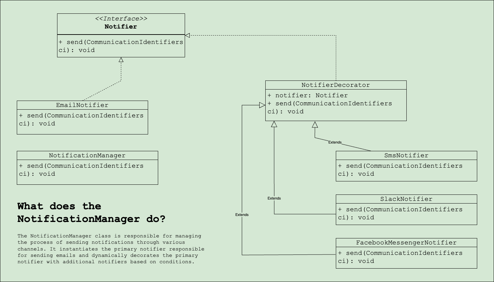

#Inventory Management System
This project is an Inventory Management System designed to demonstrate the power of clean software architecture through the application of various design patterns. By incorporating these patterns, the project highlights how they can improve code organization, maintainability, and scalability.

Design Patterns Implemented So Far:
* Observer Pattern: Notify subscribers about system events they are interested in.
* Decorator Pattern: Used decorators to dynamically add requested wrappers to the base notifier for enhanced functionality.
    - Design of the Notifiers:
    

Stay tuned for more patterns and features as the project evolves!