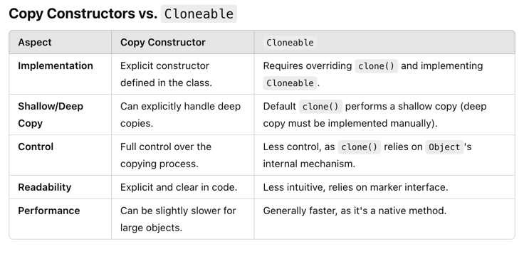

# Prototype

---

- **Creational Design Pattern**
- Prototype is fundamentally about creating a new object by copying an existing one.
- Prototype is useful when creating a copy instance of a class is resource-intensive or complicated.
  - For example, if you have an object with many fields, and you need to create a new object with the same fields, setting each field individually can be costly. In such scenarios, the prototype pattern is beneficial.
  - Setting fields individually is not maintainable. Adding new fields to the object requires changes to the client code where the fields of the clone are being set.

## Implementation
- Object.clone() along with Cloneable interface in Java follows prototype design pattern.
- A copy constructor can also be considered as an implementation of prototype.

I have implemented the pattern in two ways.
- I have used Java's marker interface `Cloneable` and Object's `clone()` method to create a copy of the object.
  - The default `super.clone()` implementation creates a shallow copy of the object. If the object has reference fields, the reference fields are copied as it is. If the reference fields are mutable, the changes made to the reference fields in the cloned object will reflect in the original object.
  - The deep copy implementation needs to be done manually.
- (Better approach) I have also implemented the pattern using copy constructor.
  - This explicitly handles the deep copy of the object, and we have full control over the copy process.
  - The copy constructor is a constructor that takes an object of the same class as a parameter and creates a new object by copying the fields of the passed object.

## Advantages of Using Copy Constructors in the Prototype Pattern
1. Better Control:
    - Copy constructors give explicit control over how the new object is initialized, allowing you to define a deep copy if necessary.
2. No Marker Interface:
    - Unlike `Cloneable`, there's no need for a marker interface or reliance on the `clone()` method.
3. Cleaner Design:
    - Copy constructors are explicit in the code, making them more readable and less error-prone.
   
## What is a Shallow Copy and a Deep Copy?
- **Shallow Copy**: 
  - A shallow copy duplicates the object's top-level structure but does not recursively copy objects referenced by the original object.
  - If the object has fields that are references to other objects, the shallow copy will copy only the references, not the actual objects. This means both the original and copied objects will share the same referenced objects.
- **Deep Copy**: 
  - A deep copy duplicates the object and all objects referenced by the object.
  - This ensures the original and copied objects are entirely independent.
  - Deep copying requires manually cloning or creating new instances of referenced objects.

## References
1. https://refactoring.guru/design-patterns/prototype
